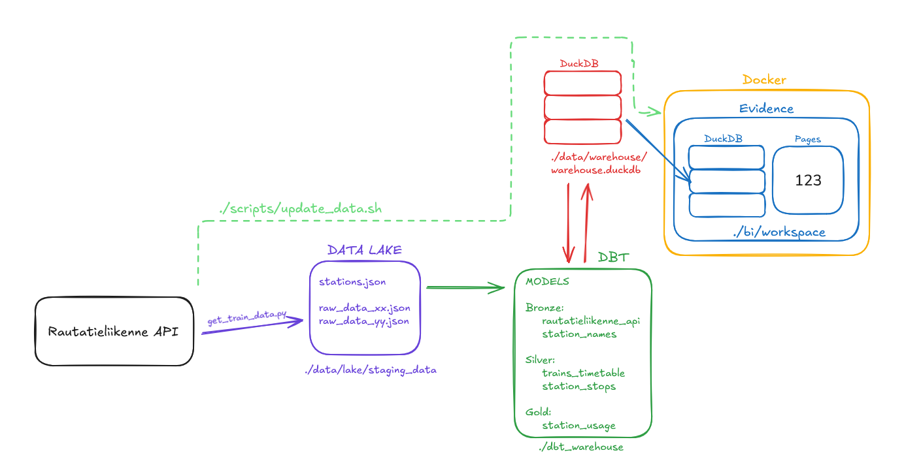
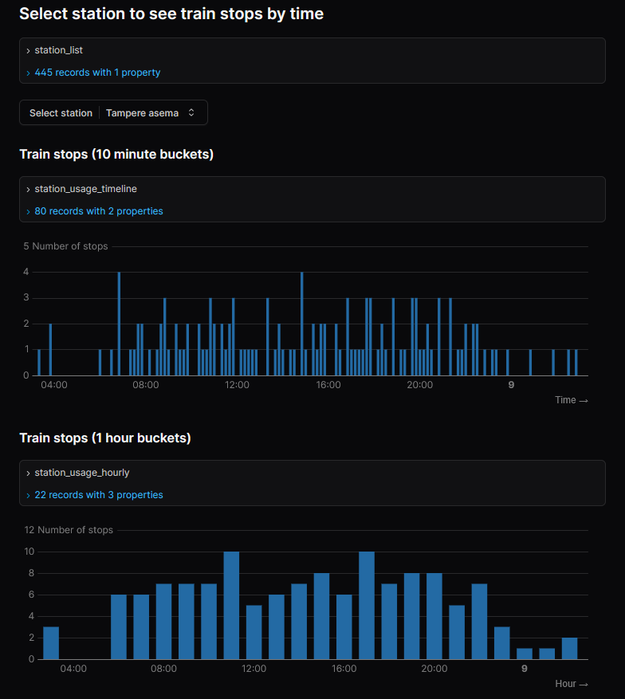

# KAMK Data-alustat 2025 kurssityö

Tässä projektissa haetaan dataa Digitrafficin Rautatieliikenne-rajapinnasta (https://www.digitraffic.fi/) Python-skriptillä, tallennetaan se DuckDB-tietokantaan DBT:n avulla ja visualisoidaan rautatieasemien junaliikennettä Docker-kontissa pyörivän Evidence-BI-työkalun avulla. 

Tähänastiset visualisoinnit kertovat
- kiireisimmät asemat käyttäjän valitsemana päivämääränä
- käyttäjän valitseman aseman junaliikennemäärät valittuna päivämääränä
- valitun aseman junaliikennemäärän jakautuminen eri viikonpäiville

Projektissa käytetty Docker- ja Docker Compose -konfiguraatio pohjautuu kurssin opettajan tarjoamaan malliin, jota on hyödynnetty erityisesti Evidence BI:n pystytykseen. Varsinainen datan ingest, tietokantamallinnus ja analyysi on toteutettu itsenäisesti.

## Arkkitehtuuri



## Projektin asennus

```
git clone <repo-url>
cd <repo>
uv sync
```

## Datan hakeminen tietokantaan

API:sta haetaan junien lähtö- ja saapumistapahtumadataa sekä metadataa, josta saadaan yhdistettyä asemien nimet UIC-koodeihin.

Dataa voi lisätä haluamaltaan ajanjaksolta tietokantaan ajamalla projektikansiossa

```bash scripts/update_data.sh <start date> <end date>```

ja antamalla päivämäärät muodossa YYYY-MM-DD. 

Tämä ajaa ``src/ingestor/get_train_data.py``n ja tarvittavat dbt-komennot.

## Tietokantamallin dokumentaatio 

Tietokantataulujen rakennetta ja selitteitä voi tarkastella:

```
cd dbt_warehouse
uv run dbt docs generate
uv run dbt docs serve
```

Dokumentaatio aukeaa osoitteessa ``http://localhost:8080``.

## Evidence BI-näkymä

Evidencen workspace-kansio on ensin kertaalleen initialisoitu näin:

```
docker compose -f docker-compose.init.yml up --build
docker compose -f docker-compose.init.yml down
```

Evidenceä voi käyttää seuraavasti:

```
docker compose build
docker compose up --watch
```

Tällöin Evidence aukeaa osoitteessa ``http://localhost:3000``.

Alla on esimerkkikuva Evidence-näkymästä.



## Projektin rakenne

Projektikansion olennaisia sisältöjä:

```
├─ bi/                              # Evidence
├─ data/
    ├─ lake/staging_data/           # Raaka data json-tiedostoina
    ├─ warehouse/warehouse.duckdb   # DuckDB-tietokanta
├─ dbt_warehouse/                   # dbt-mallit ja -määritykset
├─ scripts/
    ├─ update_data.sh               # Bash-skripti datan ajamiseksi tietokantaan
├─ src/
    ├─ ingestor/get_train_data.py   # Python-skripti, joka noutaa datan
├─ docker-compose.yml
├─ pyproject.toml
├─ uv.lock
├─ README.md
```
